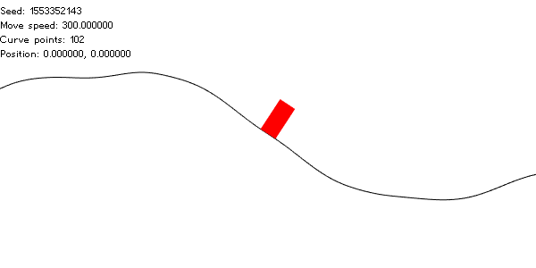

# Infinite Curve

Original request: https://daynhauhoc.com/t/cach-lam-duong-cong-de-nhan-vat-chay-tren-do/84300



Curve ~ array of vertex, where
`curve[i].x = xStep * i`,
`curve[i].y = yGen(x)`

`yGen` is a function that uses (improved) Perlin noise ([Java implementation reference](https://mrl.nyu.edu/~perlin/noise/))

```C++
ImprovedPerlinNoise noiseGen;
//seed `noiseGen` ...
auto yGen = [&](float x) {
    const float xScale = 2e-3f;
    const float yMagnitude1 = 10;
    const float yMagnitude2 = 120;
    const float yMagnitude3 = 60;
    const float yMagnitude4 = 20;

    const float xScaled = x * xScale;
    return float(yMagnitude1 * noiseGen.noise(xScaled * 0.5) +
                 yMagnitude2 * noiseGen.noise(xScaled * 1) +
                 yMagnitude3 * noiseGen.noise(xScaled * 2) +
                 yMagnitude4 * noiseGen.noise(xScaled * 4));
};
```
Have fun playing with those constants.